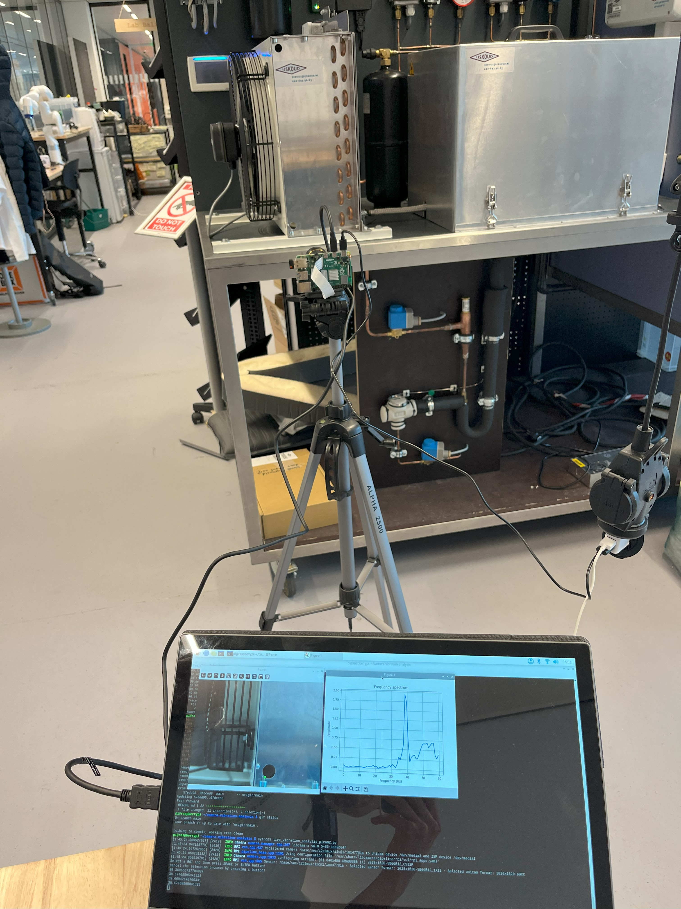

# Raspberry Pi Camera Vibration Analysis

## Hardware requirements
- Raspberry Pi 4
- Raspberry Pi High Quality Camera

## Package requirements
```
numpy=1.26.4
matplotlib==3.9.4
opencv-python==4.11.0
picamera2==0.3.12
pandas
scipy
plotly
```
Make sure that `python3-pil.imagetk` is installed on the Raspberry Pi:
```
sudo apt update
sudo apt install python3-pil.imagetk
```

## Running the program
To run the live camera vibration analysis on Raspberry Pi4, use the command:
```python3 live_vibration_analysis_picam2.py ```
If you want to do offline vibration analysis, check out ```frequency_analysis.ipynb```.

Example demo: 

